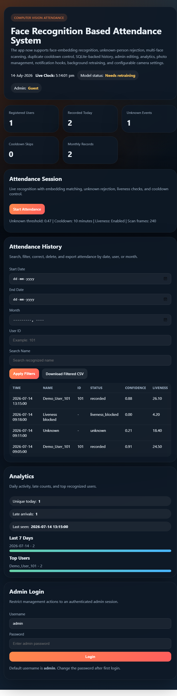
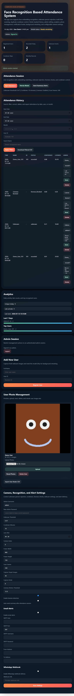
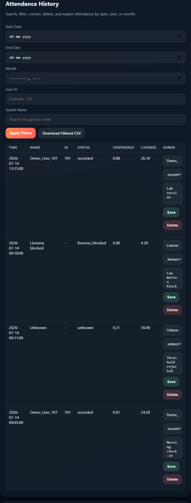
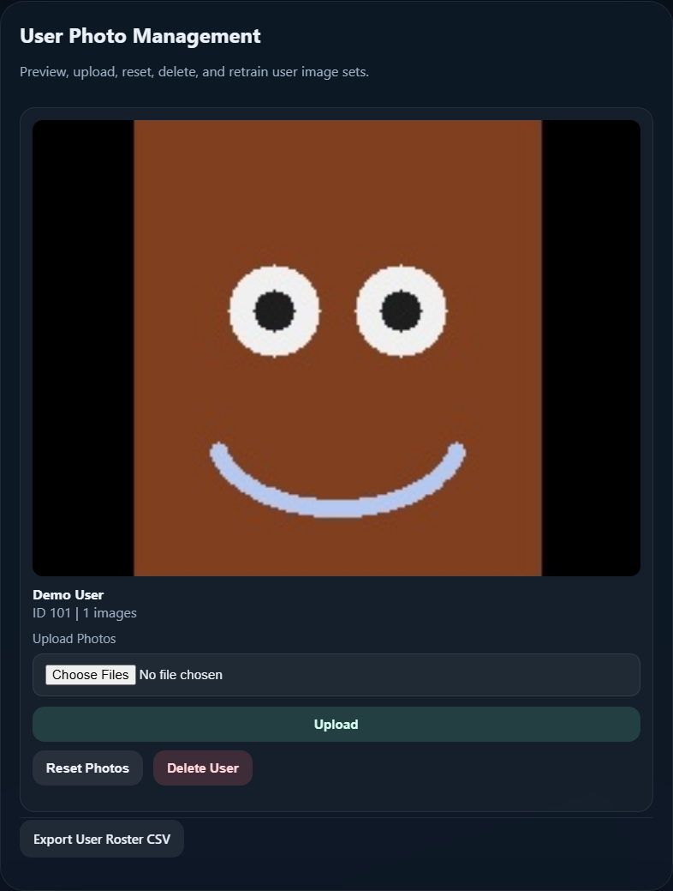
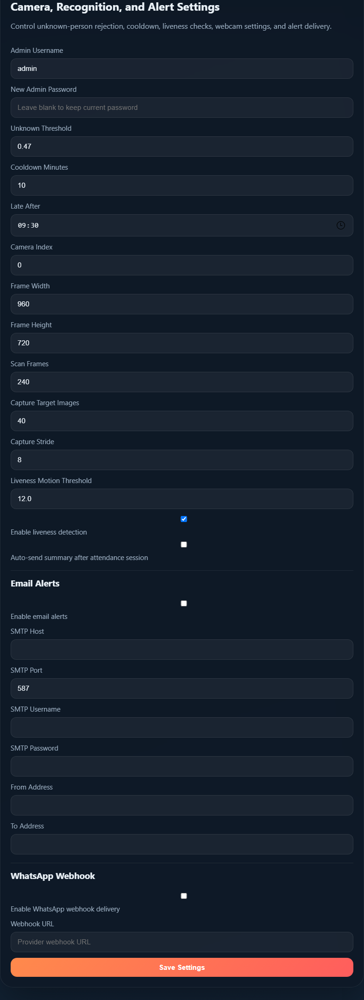

# Face Recognition Based Attendance System

This repository now contains a much broader attendance platform instead of a basic webcam demo. It uses Flask, OpenCV descriptor embeddings, SQLite-backed attendance history, admin-only management routes, configurable recognition settings, and alert hooks for summary delivery.

## Stack

- Flask
- OpenCV
- OpenCV HOG-based face descriptors
- SQLite
- NumPy
- joblib

## Current Features

- Face descriptor upgrade
  - Recognition uses vector descriptors instead of flattened raw images.
- Unknown-person rejection
  - A configurable distance threshold rejects low-confidence matches as `Unknown`.
- Multi-face attendance
  - Every detected face in the frame is processed during attendance scanning.
- Duplicate cooldown
  - A configurable cooldown window prevents repeat marking for the same person.
- Admin dashboard
  - Admin login gates user management, settings, attendance correction, retraining, and alert actions.
- Monthly database storage
  - Attendance now persists in `attendance.db` with timestamps and month keys for reporting.
- User photo management
  - Admins can register users from webcam capture, upload additional photos, reset photo sets, and delete users.
- Attendance analytics
  - The dashboard shows daily totals, top recognized users, late-arrival counts, and monthly volume.
- Login and roles
  - The app supports an admin session and stores user roles in the database.
- Liveness detection
  - A simple motion-based liveness check blocks low-motion face crops to reduce spoofing.
- Email or WhatsApp alerts
  - Optional SMTP email delivery and webhook-based WhatsApp provider integration are configurable in settings.
- Export improvements
  - Attendance export supports date-range, month, user, and search filtering.
- Camera settings panel
  - Camera index, resolution, scan length, thresholds, capture counts, and alert options are configurable from the dashboard.
- Background retraining workflow
  - User photo changes mark the model dirty, and the app retrains automatically before attendance if needed.

## Project Structure

```text
face-recognition-based-attendance-system/
|-- app.py
|-- attendance.db
|-- requirements.txt
|-- README.md
|-- templates/
|   `-- home.html
`-- static/
    |-- haarcascade_frontalface_default.xml
    `-- faces/
```

## Run

```powershell
python -m venv .venv
.venv\Scripts\Activate.ps1
pip install -r requirements.txt
python app.py
```

Then open the local Flask URL in your browser.

## Admin Access

The default admin session is:

- Username: `admin`
- Password: `admin123`

Change the password from the settings form after first login.

## Interface Walkthrough

### Guest Dashboard

This is the public landing view before admin login.



### Admin Dashboard

After admin login, the page expands into the full management workspace.



### Attendance History

History supports filtering, correction, deletion, and CSV export.



### User Photo Management

Admins can preview user images, upload new photos, reset image sets, and delete users.



### Recognition and Alert Settings

Camera settings, thresholds, liveness options, and alert integrations are all configured from the dashboard.



## Key Runtime Behavior

- User and attendance data are stored in SQLite at `attendance.db`.
- Face image files stay under `static/faces/`.
- The model bundle is stored in `static/face_recognition_model.pkl`.
- Attendance scanning retrains automatically when photo changes make the model stale.
- Liveness detection is intentionally lightweight. It is a basic anti-photo heuristic, not a production anti-spoofing model.
- Alert delivery only works when valid SMTP or webhook settings are configured.

## Notes

- The recognition pipeline is designed to run with OpenCV and NumPy only, which avoids the heavier `dlib` toolchain on this Windows setup.
- The app is now much closer to a portfolio-grade admin tool than the original student prototype, but it is still local-first and not yet hardened for internet exposure.
- If you want stronger recognition quality after this pass, the next major upgrade is a higher-end face embedding backend such as InsightFace plus real spoof detection.
